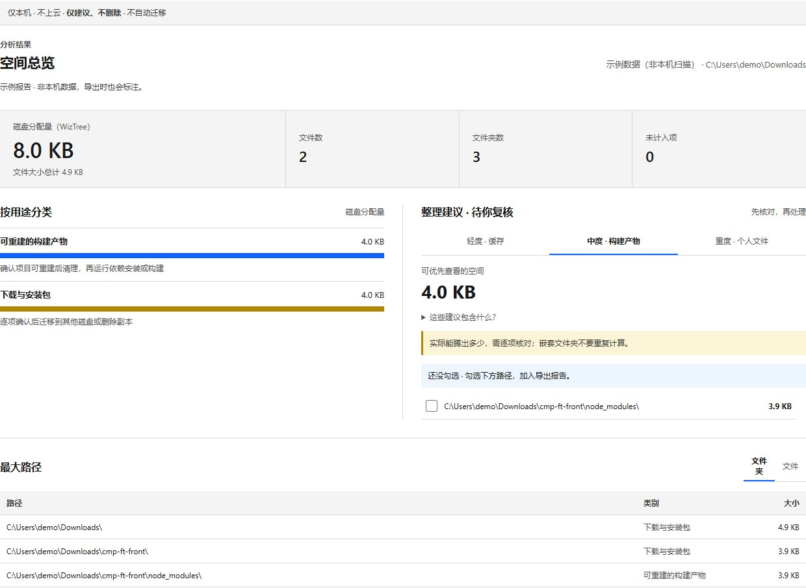

# DiskPilot

> [!IMPORTANT]
> **推荐使用轻量版 [DiskPilot Lite](https://github.com/xpeng5278-web/diskpilot-lite)。** 它只有约 23 KB，双击一次就能扫描 C 盘并生成清理建议报告，不需要 Node。下载地址：<https://github.com/xpeng5278-web/diskpilot-lite/releases/latest>
>
> We recommend the lightweight [DiskPilot Lite](https://github.com/xpeng5278-web/diskpilot-lite) (about 23 KB, one double-click to scan drive C:). This repository is kept for reference.

[](LICENSE)
[](package.json)
[](#快速试用)
[](https://github.com/xpeng5278-web/diskpilot/releases)

看懂 Windows 磁盘空间去了哪里，再决定如何整理。DiskPilot 借助本机 WizTree 扫描，将占用按用途分类，列出最大的文件和文件夹，并生成可导出的中文复核报告。扫描结果留在本机；项目目前只提供建议，不会删除或迁移文件。

DiskPilot is a local-first Windows disk-space diagnosis tool powered by your own WizTree installation. It groups disk usage, highlights large paths, and exports a reviewable report. No scan data is uploaded; no files are deleted or moved.


*演示报告使用 GB 级的完全虚构数据与路径，不是本机扫描。当前为开发预览版，首个便携版正在测试中。*
*Demo uses a GB-scale fictional sample dataset, not a real scan.*

## 快速试用

### 方式 1：下载便携版（推荐）

前往 [Releases](https://github.com/xpeng5278-web/diskpilot/releases)，下载 `DiskPilot-<版本>-win-x64.zip`，解压到任意目录（支持空格和中文路径），双击 `启动 DiskPilot.cmd`（或 `Start-DiskPilot.cmd`）。便携版内置官方 Node.js 运行时，无需另装 Node.js；桌面助手需要 .NET Framework 4（Windows 10/11 已内置）。保持启动窗口打开，访问窗口显示的本机地址。

首个便携版正在测试，Releases 中可能暂时还没有下载文件。

WizTree 必须单独安装：在终端运行 `winget install AntibodySoftware.WizTree`，或从 [WizTree 官网](https://diskanalyzer.com/download) 下载，安装后重启 DiskPilot。压缩包不包含 WizTree；“加载示例报告”无需 WizTree 即可使用。

### 方式 2：从源码运行

在 Windows 上安装 Node.js 20 或更高版本及 WizTree，然后运行：

```powershell
git clone https://github.com/xpeng5278-web/diskpilot.git
cd diskpilot
npm run desktop
```

保持桌面助手窗口打开，访问终端显示的本机地址。可先点击“加载示例报告”查看界面；实际扫描需点击“扫描本机固定磁盘”或选择文件夹后点击“扫描此路径”。WizTree 需单独安装，本项目不包含其程序文件。详见下方“运行”和“隐私”。

界面规范见 [DESIGN.md](DESIGN.md)。它参考了 Awesome DESIGN.md 中的 IBM 分析，但已按本地磁盘诊断工作台的用途重写，不使用 IBM 品牌元素。

## 当前功能

- 桌面助手打开 Windows 目录选择器，只返回绝对路径；不会枚举或上传文件。
- 默认可扫描 Windows 识别的所有就绪固定磁盘；不自动开始，也不包含网络盘或标记为可移动的磁盘。
- 确认路径后由 WizTree 扫描，也可手动输入绝对路径或磁盘根目录。
- 扫描时显示当前磁盘与阶段。WizTree 扫描阶段使用不确定进度条；解析 CSV 时显示实际读取百分比。
- 结果同时显示文件大小总计和 WizTree 磁盘分配量；极小文件的分配量可能为 0 B，不代表文件不存在。
- 对系统目录、开发缓存、构建产物、下载目录和个人文件做规则分类。
- 轻度、中度、重度方案展示候选空间，帮助决定先检查什么。
- 所有分析在本机完成；WizTree 生成的临时 CSV 解析后立即删除，不上传到外部服务。
- 在分级方案中勾选待复核路径，导出包含勾选清单的 Markdown 报告；勾选只表示待你核对，不会触发任何操作。
- 只提供建议，不执行文件删除或迁移。



*静态截图同样来自内置示例报告，不是本机扫描。*

## 运行

安装 Node.js 20 或更高版本和 WizTree 后，在当前 Windows 桌面的终端里进入项目目录运行 npm run desktop。它使用 Windows 自带的 .NET Framework 4 编译并启动桌面助手，同时启动本机网页服务。保持桌面助手窗口打开，再访问终端显示的地址。点击网页里的“选择文件夹”只会填入路径；点击“扫描此路径”或“扫描本机固定磁盘”才会运行 WizTree。WizTree 需要由用户单独安装，本项目不包含它的程序文件。

只运行 npm start 可预览网页和手动输入路径；没有桌面助手时，选择按钮会立即提示启动助手。浏览器本身不能读取所选目录的绝对路径。

如果网页服务已经在运行，也可单独打开 `outputs/DiskPilotDesktop.exe`。桌面助手只监听本机 `127.0.0.1:4175`；若该端口被占用，助手窗口会显示错误。

如果 WizTree 安装在非标准位置，设置 WIZTREE_PATH 环境变量指向 WizTree64.exe。本机开发目录中的 Tools/WizTree 也会自动识别。

运行测试：npm test。

### 打包

运行 `npm run package:win` 可构建 Windows 便携版 zip，支持从任意操作系统打包。压缩包内置官方 Node.js 运行时，不包含 WizTree。

## 现阶段边界

- 候选空间不是承诺可释放的空间。相同内容可能被多个父级文件夹显示；分类合计只按文件行计算。
- 扫描范围和权限由 WizTree 决定；当前默认不请求管理员权限，完整 C 盘扫描可能较慢或跳过部分受保护目录。
- “扫描本机固定磁盘”按盘符依次扫描。任一磁盘失败会结束本次任务，不会将部分结果伪装成完整报告。
- 异常退出时可能留下 outputs 目录中的临时 CSV，请在重启前检查并删除这些文件。
- 暂未接入 AI、自定义规则、执行器或回滚。下一阶段先做审阅清单和迁移验证，再考虑一键执行。

## 路线图

1. 增加磁盘总量和目标盘可用空间检查，生成可审阅的迁移清单。
2. 增加可配置的 AI 服务，仅发送用户明确选中的摘要。
3. 增加执行预览、冲突检测、校验和回滚记录。
4. 将桌面助手和本机网页打包为一个签名安装包。

## 隐私

目录名和文件名可能包含个人信息。公开反馈时请对路径截图和报告脱敏。本项目目前不会主动调用任何外部网络 API，也不打包 WizTree。WizTree 的使用及分发须遵守其官方许可：https://diskanalyzer.com/eula 。

## 参与

欢迎提交误分类案例、启动或扫描问题，以及 Windows 应用迁移经验。请使用 [问题模板](.github/ISSUE_TEMPLATE/bug_report.md)，公开反馈前先对路径、用户名和报告脱敏；详见 [CONTRIBUTING.md](CONTRIBUTING.md)。

## 许可证

项目代码采用 [MIT License](LICENSE)。WizTree 是独立软件，不包含在本项目中，使用和分发仍以其官方许可为准。
